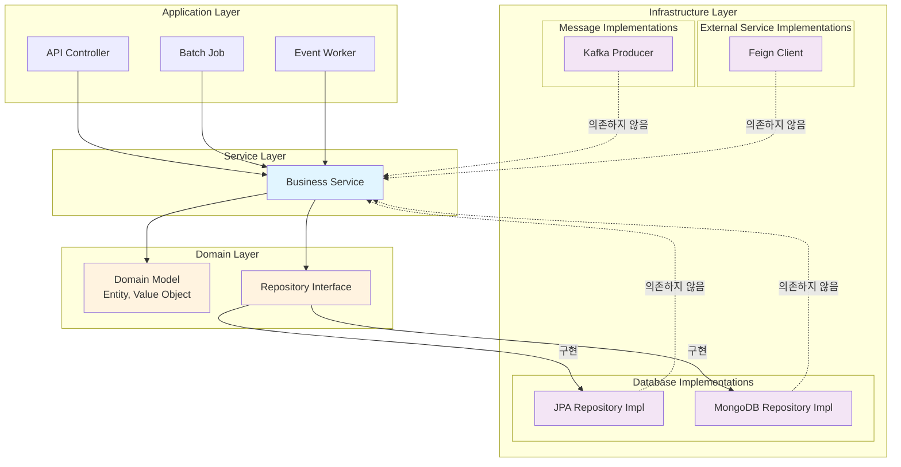
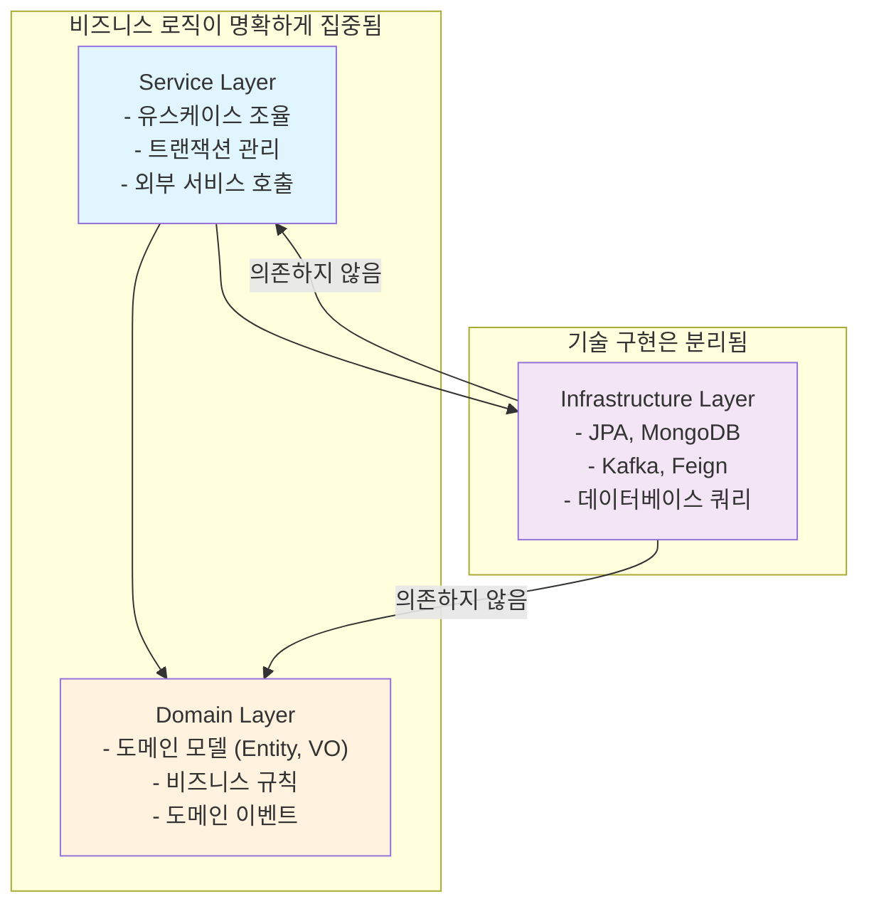
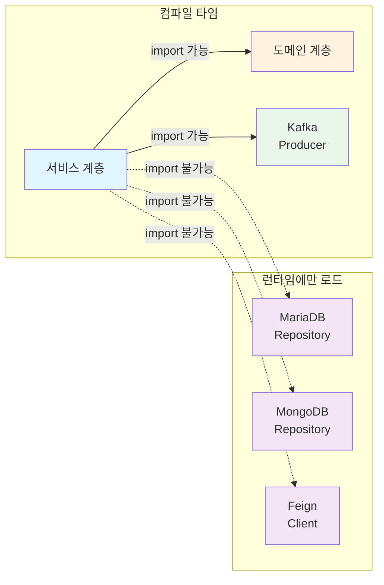

## 레이어드 아키텍처 없이는 무엇이 문제일까?

회사 서비스에서 표절 탐지 시스템을 구축하려면 후보 데이터, 인덱싱, 복사 비율 계산 등 다양한 도메인 로직이 필요합니다.
비즈니스 로직과 인프라 기술이 섞여 있다면 어떤 문제가 발생할까요?

### 1. **기술 변경의 파급 효과**

인프라에 의존적인 구조에서 기술을 변경하면 비즈니스 로직까지 영향을 받습니다.

```
❌ 인프라에 의존적인 구조
Service Layer
  ↓ (직접 의존)
JPA, MongoDB, Kafka...
```

만약 데이터베이스를 MariaDB에서 MongoDB로 변경하려면?
- 서비스 코드가 JPA Entity를 직접 참조하고 있다면?
- 서비스 로직을 수정해야 합니다.
- 테스트 코드도 수정해야 합니다.
- 변경의 범위가 예측 불가능해집니다.

### 2. **테스트의 어려움**

인프라 의존성 때문에 단위 테스트가 어렵습니다.

```
Service A
  ↓ (의존)
JPA Repository
  ↓ (의존)
실제 데이터베이스
```

- 테스트를 실행할 때마다 데이터베이스를 세팅해야 합니다.
- 테스트 속도가 느려집니다.
- 외부 리소스 없이 단순한 로직을 테스트할 수 없습니다.

### 3. **비즈니스 로직의 분산**

비즈니스 로직이 인프라 계층에 흩어집니다.

```
비즈니스 로직 (Service Layer)
비즈니스 로직 (JPA Entity Listener)
비즈니스 로직 (Query DSL Custom Method)
비즈니스 로직 (Event Listener)
```

어디서 전체 로직을 이해할 수 없고, 버그가 여러 곳에 숨어 있을 수 있습니다.

### 4. **도메인 지식의 손실**

기술 구현에만 집중하다 보면 핵심 비즈니스 요구사항이 명확하지 않습니다.

```
"CandidateGroup을 생성하는 것이 뭐지?"
→ CandidateGroupJpaEntity를 생성하는 것이다 (인프라 관점)
→ 도메인 모델의 의도가 불명확하다
```

---

## 해결책: 레이어드 아키텍처로 독립성 확보

이러한 문제들을 해결하기 위해 다음과 같은 원칙을 적용합니다:

### **핵심 원칙**

1. **하위 레이어는 상위 레이어에 의존하지 않는다** (의존성 역전)
2. **비즈니스 로직은 인프라 기술에 의존하지 않는다**
3. **도메인 리포지토리 인터페이스를 통한 추상화**

### **아키텍처 전체 구조**



---

## 문제 1: 기술 변경의 파급 효과 → 해결

### **도메인 리포지토리 인터페이스로 추상화**

서비스 계층은 인프라 기술을 모릅니다. 도메인이 정의한 인터페이스만 봅니다.

**도메인 계층에서 정의한 인터페이스:**

```java
// 도메인 계층 - 인프라 의존성 없음
public interface CandidateGroupRepository {
    CandidateGroup save(CandidateGroup candidateGroup);
    Optional<CandidateGroup> findById(CandidateGroupId candidateGroupId);
}
```

**서비스 계층에서 인터페이스만 사용:**

```java
// 서비스 계층 - JPA를 직접 알지 못함
@Service
@RequiredArgsConstructor
public class CreateCandidateGroupService {

    private final CandidateGroupRepository candidateGroupRepository;  // 인터페이스

    public CandidateGroup create(CreateCandidateGroupCommand command) {
        // JPA Entity? MongoDB Document? 상관없음
        // 서비스 코드는 변경되지 않음
        return candidateGroupRepository.save(
            CandidateGroup.create(preprocessId, localCode, organization)
        );
    }
}
```

**인프라 계층에서 구체적인 구현:**

```java
// 인프라 계층 (MariaDB + JPA 구현)
@Repository
@RequiredArgsConstructor
public class CandidateGroupRepositoryImpl implements CandidateGroupRepository {

    private final CandidateGroupJpaRepository jpaRepository;

    @Override
    public CandidateGroup save(CandidateGroup candidateGroup) {
        // 도메인 모델 → JPA Entity 변환
        return jpaRepository.save(CandidateGroupJpaEntity.from(candidateGroup))
                           .toDomain();  // JPA Entity → 도메인 모델 변환
    }

    @Override
    public Optional<CandidateGroup> findById(CandidateGroupId candidateGroupId) {
        return jpaRepository.findById(candidateGroupId.value())
                           .map(CandidateGroupJpaEntity::toDomain);
    }
}
```

### **결과: 기술 변경이 격리됨**

```
MongoDB로 변경?
→ CandidateGroupRepositoryImpl만 수정
→ 서비스 계층은 변경 없음
→ 비즈니스 로직은 안전함
```

---

## 문제 2: 테스트의 어려움 → 해결

### **도메인 계층이 인프라 의존성이 없음**

도메인 로직은 순수한 자바 객체입니다. 외부 의존성 없이 테스트할 수 있습니다.

```java
// 도메인 계층 테스트 - 아무 의존성 없이 테스트 가능
@Test
void testCandidateGroupCreation() {
    // Given
    PreprocessId preprocessId = new PreprocessId("preprocess-1");
    LocalCode localCode = new LocalCode("KR");
    Organization organization = new Organization("org-1");

    // When
    CandidateGroup group = CandidateGroup.create(preprocessId, localCode, organization);

    // Then - 순수한 자바 객체, 빠른 테스트
    assertThat(group.getPreprocessId()).isEqualTo(preprocessId);
    assertThat(group.getLocalCode()).isEqualTo(localCode);
}
```

### **서비스 계층도 Mock Repository로 빠르게 테스트**

```java
@Test
void testCreateCandidateGroupService() {
    // Given
    CandidateGroupRepository mockRepository = mock(CandidateGroupRepository.class);
    PreprocessValidator mockValidator = mock(PreprocessValidator.class);

    CreateCandidateGroupService service =
        new CreateCandidateGroupService(mockValidator, mockRepository);

    // When
    CreateCandidateGroupCommand command = new CreateCandidateGroupCommand(...);
    service.create(command);

    // Then - 빠른 테스트, 데이터베이스 필요 없음
    verify(mockRepository).save(any(CandidateGroup.class));
}
```

### **테스트 성능 비교**

```
❌ 인프라 의존적 구조
테스트 1개 = 5초 (DB 세팅 포함)
테스트 100개 = 500초

✅ 레이어드 아키텍처
테스트 1개 = 10ms
테스트 100개 = 1초
```

---

## 문제 3: 비즈니스 로직의 분산 → 해결

### **비즈니스 로직이 도메인 계층에 집중됨**

도메인 계층에 순수한 비즈니스 로직이 있고, 서비스 계층에서 조율합니다.



**도메인 계층: 핵심 비즈니스**

```java
// 도메인 계층 - 순수한 비즈니스 로직만
@Entity
public class CandidateGroup {
    private CandidateGroupId id;
    private PreprocessId preprocessId;
    private LocalCode localCode;
    private Organization organization;

    // 비즈니스 규칙
    public static CandidateGroup create(
        PreprocessId preprocessId,
        LocalCode localCode,
        Organization organization
    ) {
        // 검증, 생성 로직
        return new CandidateGroup(
            CandidateGroupId.generate(),
            preprocessId,
            localCode,
            organization
        );
    }
}
```

**서비스 계층: 유스케이스 조율**

```java
// 서비스 계층 - 비즈니스 로직 조율
@Service
@RequiredArgsConstructor
public class CreateCandidateGroupService {

    private final PreprocessValidator preprocessValidator;
    private final CandidateGroupRepository candidateGroupRepository;

    public CandidateGroup create(CreateCandidateGroupCommand command) {
        // 1. Preprocess 검증 (외부 서비스 호출)
        PreprocessId preprocessId = new PreprocessId(command.getPreprocessId());
        preprocessValidator.validate(preprocessId);

        // 2. CandidateGroup 생성 (도메인 로직)
        LocalCode localCode = new LocalCode(command.getLocalCode());
        Organization organization = new Organization(command.getOrganization());
        CandidateGroup group = CandidateGroup.create(
            preprocessId, localCode, organization
        );

        // 3. 저장 (인프라)
        return candidateGroupRepository.save(group);
    }
}
```

### **결과: 전체 비즈니스 로직 흐름이 명확함**

```
CREATE (Command)
  ↓ 검증 (Service)
  ↓ 생성 (Domain)
  ↓ 저장 (Repository)
완료
```

---

## 문제 4: 도메인 지식의 손실 → 해결

### **도메인 모델이 비즈니스 의도를 명확하게 표현**

```java
// 도메인 계층 - 비즈니스 의도가 명확
public class CandidateGroup {

    // 값 객체(Value Object)로 의도 명확하게
    private CandidateGroupId id;           // "누구인가?"
    private PreprocessId preprocessId;     // "어떤 전처리 데이터를 기반으로?"
    private LocalCode localCode;           // "어느 지역?"
    private Organization organization;    // "어느 기관?"

    // 메서드 이름도 비즈니스 의도를 표현
    public static CandidateGroup create(...) {
        // "CandidateGroup을 생성한다" - 명확한 비즈니스 의도
    }
}
```

비즈니스 분석가, 개발자, 테스터 모두가 같은 언어로 이야기할 수 있습니다.

---

## 핵심 기법: Gradle의 runtimeOnly 의존성

서비스 계층에서 인프라 계층을 컴파일 타임에 접근할 수 없도록 보장합니다.

```gradle
// 서비스 계층의 build.gradle
dependencies {
    // ✅ runtimeOnly: 런타임에만 로드됨
    // 서비스 코드에서 JPA를 직접 import 할 수 없음
    runtimeOnly project(':core:infra:client:preprocess-feign-client')
    runtimeOnly project(':core:infra:database:mongo:candidate-mongo-data')
    runtimeOnly project(':core:infra:database:mariadb:candidate-mariadb')

    // ✅ implementation: 컴파일 타임에 접근 가능
    // 도메인 계층과 인프라 메시지 큐만 직접 사용
    implementation project(':core:domain')
    implementation project(':core:infra:message:kafka:candidate-producer')
}
```

### **의존성 흐름**



### **실제 적용 결과**

서비스 계층 코드:

```java
package plagiarismchecker.service.candidate;

// ✅ import 가능
import plagiarismchecker.domain.candidate.group.CandidateGroup;
import plagiarismchecker.domain.candidate.group.CandidateGroupRepository;

// ❌ 컴파일 타임에 이 import는 불가능
// import plagiarismchecker.infra.repository.candidate.group.CandidateGroupRepositoryImpl;
// import org.springframework.data.jpa.repository.JpaRepository;
// import jakarta.persistence.Entity;
```

만약 서비스 코드에서 `@Entity`나 `JpaRepository`를 import 하려고 하면?

```
컴파일 에러!
"Cannot find symbol 'Entity'"
```

이는 개발자가 인프라를 직접 사용하지 못하도록 **컴파일 타임에 강제**합니다.

---

## 이 구조의 장점들

### **1. 기술 스택 변경의 자유도**

```
MariaDB + JPA → MongoDB + Spring Data MongoDB
변경 범위: 인프라 계층만 (20% 코드)
영향 범위: 비즈니스 로직 없음 ✓
```

### **2. 빠른 테스트와 높은 테스트 커버리지**

```
도메인 계층:     단위 테스트 → 1ms
서비스 계층:     Mock 테스트 → 10ms
통합 테스트:     실제 DB    → 100ms

전체 테스트 속도 대폭 향상 ↑
```

### **3. 명확한 책임 분리**

```
도메인 계층 ← 개발자의 집중도 ↑
 ↓ (도메인 지식)
서비스 계층 ← 비즈니스 로직 조율
 ↓ (인프라 기술)
인프라 계층 ← 기술 구현
```

각 계층의 책임이 명확하므로 코드 리뷰도 효율적입니다.

### **4. 도메인 주도 설계(DDD) 지원**

도메인이 최상위 계층(추상화 수준이 높음)에 있으므로 비즈니스 요구사항을 정확히 반영합니다.

```
비즈니스 요구사항
  ↓
도메인 설계
  ↓
서비스 구현
  ↓
기술 선택
```

### **5. 새로운 팀원의 빠른 온보딩**

```
"CandidateGroupRepository를 구현해"
→ 도메인 인터페이스만 보면 이해됨
→ JPA의 이해도와 무관하게 구현 가능
→ 신입 개발자도 쉽게 시작
```

---

## 실전: 이 구조로 새 기술 추가하기

### **시나리오: Redis 캐시 추가**

```java
// 도메인 계층에 인터페이스 추가
public interface CandidateGroupCache {
    void cache(CandidateGroup group);
    Optional<CandidateGroup> get(CandidateGroupId id);
}

// 서비스에서 사용 (선택적)
@Service
public class CreateCandidateGroupService {
    private final CandidateGroupCache cache;

    public CandidateGroup create(...) {
        // ... 생성 로직
        cache.cache(group);  // 캐싱
        return group;
    }
}

// 인프라에서만 구현 (runtimeOnly 의존성)
@Component
public class RedisCandidateGroupCache implements CandidateGroupCache {
    // Redis 기술만 여기에
}
```

**결과:**
- 서비스 계층: 변경 없음 (또는 optional)
- 도메인 계층: 선택적 확장
- 테스트: 기존 테스트 모두 통과

---

## 결론

이 레이어드 아키텍처는 다음을 보장합니다:

| 문제 | 해결책 |
|------|--------|
| 기술 변경의 파급 효과 | 도메인 리포지토리 인터페이스로 추상화 |
| 테스트의 어려움 | 순수한 도메인, Mock 기반 테스트 |
| 비즈니스 로직의 분산 | 도메인 + 서비스 계층에 집중 |
| 도메인 지식의 손실 | 명확한 도메인 모델 (Entity, VO) |
| 실수로 인한 기술 사용 | Gradle runtimeOnly로 컴파일 타임 강제 |

**결과적으로:**
```
✓ 유지보수가 쉬운 코드
✓ 빠른 개발 속도
✓ 테스트 가능한 설계
✓ 기술 변경에 유연한 구조
✓ 명확한 도메인 지식 전달
```

이것이 바로 **인프라에 독립적인 비즈니스 로직**의 가치입니다.
